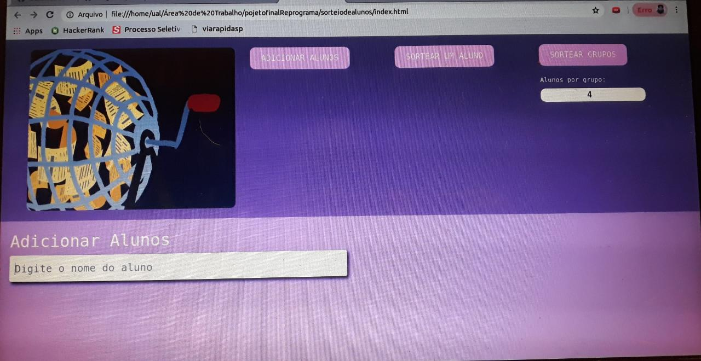

# Projeto final [RePrograma](https://reprograma.com.br/)

## Sorteio:

> Site que se insere nomes de alunos e *sorteia* um deles, ou sorteia grupos, definindo como parametros quantos grupos e quantos alunos em cada grupo

## Tecnologias utilizadas:

* HTML
* CSS
* JavaScript
* Bootstrap

## Sobre o projeto:

> O  Projeto surgiu da necessidade que eu ouvia do  meu marido, que trabalha em uma ong que capacita jovens periféricos na tecnologia, que quando fazia sorteio na sala, que seja para apresentação, eventos, ou ate mesmo brides, esses sorteios demandavam tempo, que eram feitos muitas vezes no papel ou por algum app que fazia com que os alunos decorassem um numero para si,para que fosse sorteado, perdia um pouco a identidade. 

> E eu falava que um site que fizesse o sorteio iria ajudara a ser mais pratico e impessoal  sorteio.

> No processo surgiu a demanda de fazer o sorteio de grupos, ou seja aqueles trabalhos em grupos que sempre davam trabalho para sortear quem faz com quem vai, agora vai ser sorteado simplesmente colocando os nomes dos alunos e o parâmetro de quantos alunos por grupo deseja e sortear.

> Esqueceu de colocar o nome de algum aluno ? Não tem problema, só colocar incluir o nome e sortear o grupo novamente. 

## Funcionalidades do projeto:

- [x] Usuario consegue incluir nomes
- [x] Usuario consegue excluir nomes
- [x] Sortear um aluno por vez
- [x] Escolher quantos alunos quer em cada grupo
- [x] Adicionar alunos apos o sorteio

## O projeto:
 